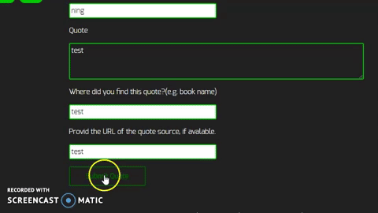

## Project 5 - quotes on dev

Responsive website that allows a user to get random post from archive using the WordPress REST API, and also allows user to submit thier own post.

## Code Example


```
  $('input[type="text"],input[type="url"]').on('blur', function () {

    if ($(this).val() !== '') {
      console.log(this);
      $(this).addClass('focusEx');
    } else {

      $(this).removeClass('focusEx');

    }

  });
```

the 'blur' function is trigger when there are input value in the input area on the submit page.



```
.done(function (data) {
      $('#quote-submission-form').hide('slow');
      $('.quote-submission-wrapper .entry-title').append('<p>' + api_vars.success + '</p>');
    });
```

after the submission the form will hide by the hide function, and submit success message will appear.


## Development

To fix a bug or enhance an existing module, follow these steps:

<ul>
<li>Fork the repo </li>
<li>Create a new branch (git checkout -b improve-feature)</li>
<li>Make the appropriate changes in the files</li>
<li>Add changes to reflect the changes made</li>
<li>Commit your changes (git commit -am 'Improve feature')</li>
<li>Push to the branch (git push origin improve-feature)</li>
<li>Create a Pull Request</li>
</ul>

## Installation

### 1. Download me (don't clone me!)

Then add me to your `wp-content/themes` directory.

### 2. Rename the `quotesondev-starter-master` directory

Make sure that the theme directory name is project appropriate! Do you need `starter` or `master` in the directory name?

### 3. Install the dev dependencies

Next you'll need to run `npm install` **inside your theme directory** to install the npm packages you'll need for Gulp, etc.

### 4. Update the proxy in `gulpfile.js`

Lastly, be sure to update your `gulpfile.js` with the appropriate URL for the Browsersync proxy (so change `localhost[:port-here]/[your-dir-name-here]` to the appropriate localhost URL).

And now would be a good time to `git init` :)

## Built with

<ul>
<li> jQuery - Ajax - jQuery simplifies HTML document traversing, event handling, animating, and Ajax interactions for rapid web development.</li>
<li> The WordPress REST API provides API endpoints for WordPress data types that allow developers to interact with sites remotely by sending and receiving JSON (JavaScript Object Notation) objects. JSON is an open standard data format that is lightweight and human-readable, and looks like Objects do in JavaScript; hence the name. When you send content to or make a request to the API, the response will be returned in JSON. This enables developers to create, read and update WordPress content from client-side JavaScript or from external applications, even those written in languages beyond PHP.</li>
</ul>


## Contributors

sslnyx

## License

<p>The license under which the WordPress software is released is the GPLv2 (or later) from the Free Software Foundation. A copy of the license is included with every copy of WordPress, but you can also read the text of the license here.</p>

<p>Part of this license outlines requirements for derivative works, such as plugins or themes. Derivatives of WordPress code inherit the GPL license. Drupal, which has the same GPL license as WordPress, has an excellent page on licensing as it applies to themes and modules (their word for plugins).</p>

<p>There is some legal grey area regarding what is considered a derivative work, but we feel strongly that plugins and themes are derivative work and thus inherit the GPL license. If you disagree, you might want to consider a non-GPL platform such as Serendipity (BSD license) or Habari (Apache license) instead.</p>